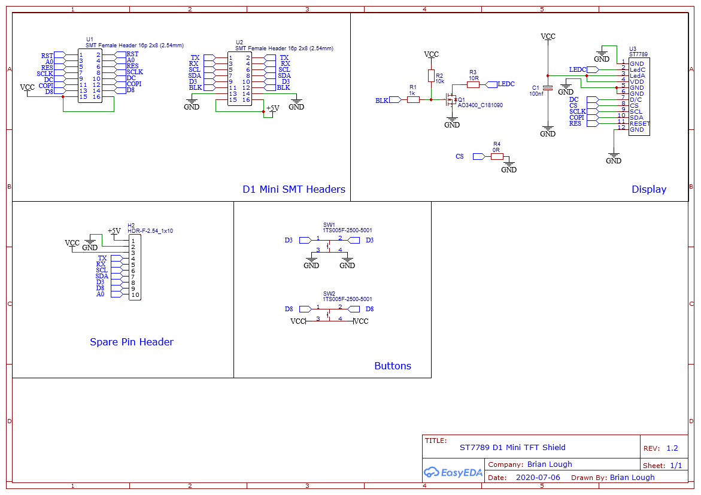

# D1 Mini TFT Shield Hardware

This project was designed using EasyEDA and the entire project is shared here at [this link](https://easyeda.com/ecenuig/st7789-d1-mini-shield).

The schematic, gerber and BOM files for the V1.2 release of the board can be found in the "1.2" folder of this repo.

This project is licensed under the CERN Open Hardware License V1.2. Details of the license can be found in license.md at the root of the repo.

